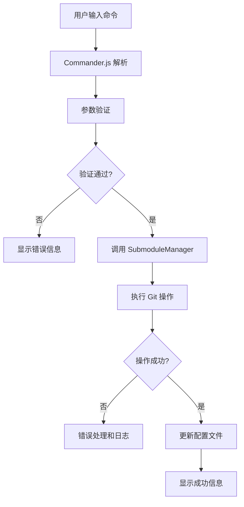
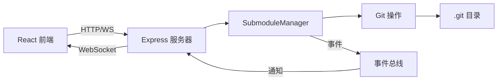
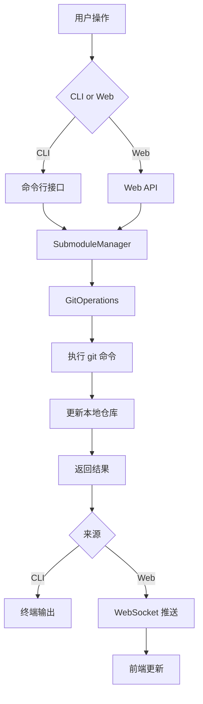

# Git Submodule Manager - 架构设计文档

## 📦 项目概述

**项目名称**: `@ldesign/submodule-manager` (或简称 `lsm`)

**技术栈**:
- **运行时**: Node.js 18+
- **语言**: TypeScript 5+
- **CLI 框架**: Commander.js
- **Web 后端**: Express.js
- **Web 前端**: React 18 + Vite + TailwindCSS
- **实时通信**: Socket.io
- **测试**: Jest + Testing Library
- **代码质量**: ESLint + Prettier + Husky

---

## 🏗️ 项目结构

```
ldesign-submodule-manager/
├── src/
│   ├── cli/                    # CLI 命令实现
│   │   ├── commands/          # 各个命令的实现
│   │   │   ├── add.ts
│   │   │   ├── remove.ts
│   │   │   ├── list.ts
│   │   │   ├── status.ts
│   │   │   ├── update.ts
│   │   │   ├── sync.ts
│   │   │   ├── foreach.ts
│   │   │   ├── batch.ts
│   │   │   └── serve.ts
│   │   ├── utils/             # CLI 工具函数
│   │   └── index.ts           # CLI 入口
│   │
│   ├── core/                   # 核心业务逻辑
│   │   ├── SubmoduleManager.ts    # 核心管理类
│   │   ├── GitOperations.ts       # Git 底层操作
│   │   ├── ConfigManager.ts       # 配置管理
│   │   ├── types.ts               # TypeScript 类型定义
│   │   └── utils.ts               # 工具函数
│   │
│   ├── server/                 # Web 服务器
│   │   ├── routes/            # API 路由
│   │   │   ├── submodules.ts
│   │   │   ├── config.ts
│   │   │   └── operations.ts
│   │   ├── middleware/        # 中间件
│   │   ├── websocket/         # WebSocket 处理
│   │   └── index.ts           # 服务器入口
│   │
│   ├── web/                    # React 前端
│   │   ├── src/
│   │   │   ├── components/    # React 组件
│   │   │   │   ├── SubmoduleList.tsx
│   │   │   │   ├── SubmoduleCard.tsx
│   │   │   │   ├── AddSubmoduleForm.tsx
│   │   │   │   ├── OperationLog.tsx
│   │   │   │   └── DependencyTree.tsx
│   │   │   ├── hooks/         # 自定义 Hooks
│   │   │   ├── services/      # API 服务
│   │   │   ├── stores/        # 状态管理
│   │   │   ├── App.tsx
│   │   │   └── main.tsx
│   │   ├── public/
│   │   └── vite.config.ts
│   │
│   └── shared/                 # 共享代码
│       ├── constants.ts
│       ├── errors.ts
│       └── validators.ts
│
├── tests/                      # 测试文件
│   ├── unit/
│   ├── integration/
│   └── e2e/
│
├── docs/                       # 文档
│   ├── CLI.md                 # CLI 使用文档
│   ├── API.md                 # API 文档
│   └── EXAMPLES.md            # 示例
│
├── scripts/                    # 构建脚本
│   ├── build.ts
│   └── publish.ts
│
├── .github/
│   └── workflows/             # CI/CD
│       ├── test.yml
│       └── publish.yml
│
├── package.json
├── tsconfig.json
├── .eslintrc.js
├── .prettierrc
└── README.md
```

---

## 🎯 核心功能模块

### 1. SubmoduleManager (核心管理类)

```typescript
class SubmoduleManager {
  // 基础操作
  async add(url: string, path: string, options?: AddOptions): Promise<void>
  async remove(path: string, options?: RemoveOptions): Promise<void>
  async update(path?: string, options?: UpdateOptions): Promise<void>
  async list(options?: ListOptions): Promise<SubmoduleInfo[]>
  async status(path?: string): Promise<SubmoduleStatus[]>
  
  // 高级操作
  async sync(): Promise<void>
  async foreach(command: string): Promise<void>
  async checkout(branch: string, path?: string): Promise<void>
  
  // 批量操作
  async batchAdd(configs: SubmoduleConfig[]): Promise<void>
  async batchUpdate(options?: BatchUpdateOptions): Promise<void>
  
  // 分析功能
  async analyze(): Promise<AnalysisResult>
  async getDependencyTree(): Promise<DependencyTree>
  async healthCheck(): Promise<HealthCheckResult>
}
```

### 2. CLI 命令结构

```bash
# 基础命令
lsm add <url> <path> [options]
lsm remove <path> [options]
lsm list [options]
lsm status [path]
lsm update [path] [options]

# 高级命令
lsm sync
lsm foreach <command>
lsm checkout <branch> [path]

# 批量操作
lsm batch add -f <config-file>
lsm batch update [options]

# 配置管理
lsm config set <key> <value>
lsm config get <key>
lsm config list

# 分析工具
lsm analyze
lsm tree
lsm check

# Web 界面
lsm serve [options]
```

### 3. Web API 端点

```
GET    /api/submodules              # 获取所有 submodule
POST   /api/submodules              # 添加 submodule
PUT    /api/submodules/:path        # 更新 submodule
DELETE /api/submodules/:path        # 删除 submodule
GET    /api/submodules/:path/status # 获取状态

GET    /api/config                  # 获取配置
PUT    /api/config                  # 更新配置

POST   /api/operations/sync         # 同步操作
POST   /api/operations/foreach      # 批量执行命令
POST   /api/operations/analyze      # 分析依赖

WS     /ws                          # WebSocket 实时更新
```

---

## 🔄 系统架构流程图

### CLI 命令执行流程



### Web 应用架构



### 数据流向



---

## 🎨 Web 界面设计

### 主要页面

1. **Dashboard (仪表板)**
   - 显示所有 submodule 列表
   - 快速状态概览
   - 操作快捷按钮

2. **Submodule 详情**
   - 详细信息展示
   - 提交历史
   - 分支切换
   - 操作日志

3. **批量操作**
   - 批量更新
   - 批量添加
   - 批量删除

4. **依赖分析**
   - 依赖树可视化
   - 冲突检测
   - 健康检查报告

5. **配置管理**
   - 全局配置
   - 项目配置
   - 预设管理

---

## 🔧 核心技术实现

### 1. Git 操作封装

使用 Node.js `child_process` 执行 git 命令:

```typescript
import { exec } from 'child_process';
import { promisify } from 'util';

const execAsync = promisify(exec);

async function executeGitCommand(command: string): Promise<string> {
  const { stdout, stderr } = await execAsync(`git ${command}`);
  if (stderr) throw new Error(stderr);
  return stdout;
}
```

### 2. 配置管理

支持多层级配置:
- 全局配置: `~/.lsmrc`
- 项目配置: `.lsmrc` 或 `package.json` 中的 `lsm` 字段
- 命令行参数覆盖

### 3. 错误处理

统一的错误类型:
```typescript
class SubmoduleError extends Error {
  constructor(
    message: string,
    public code: string,
    public details?: any
  ) {
    super(message);
  }
}
```

### 4. 实时更新

使用 Socket.io 实现实时进度推送:
```typescript
io.on('connection', (socket) => {
  manager.on('progress', (data) => {
    socket.emit('operation:progress', data);
  });
});
```

---

## 📋 配置文件格式

### .lsmrc (YAML)

```yaml
# 全局配置
default:
  branch: main
  recursive: true
  jobs: 4

# 预设配置
presets:
  production:
    - name: frontend
      url: https://github.com/org/frontend.git
      path: packages/frontend
      branch: main
    - name: backend
      url: https://github.com/org/backend.git
      path: packages/backend
      branch: main

# 别名
aliases:
  ls: list --verbose
  up: update --recursive
```

---

## 🧪 测试策略

### 单元测试
- 核心类方法测试
- 工具函数测试
- 覆盖率目标: 80%+

### 集成测试
- CLI 命令端到端测试
- API 端点测试
- Git 操作测试

### E2E 测试
- Web 界面交互测试
- 完整工作流测试

---

## 📦 发布策略

### NPM 包结构

```json
{
  "name": "@ldesign/submodule-manager",
  "version": "1.0.0",
  "bin": {
    "lsm": "./dist/cli/index.js"
  },
  "main": "./dist/core/index.js",
  "types": "./dist/core/index.d.ts",
  "files": ["dist", "README.md", "LICENSE"]
}
```

### 版本管理

遵循语义化版本 (SemVer):
- MAJOR: 破坏性更改
- MINOR: 新功能
- PATCH: 错误修复

---

## 🚀 开发路线图

### Phase 1: MVP (最小可行产品)
- ✅ 项目初始化
- ✅ 核心 Git 操作
- ✅ 基础 CLI 命令
- ✅ 基础测试

### Phase 2: 增强功能
- 高级 CLI 命令
- 配置管理系统
- 错误处理优化
- 完整测试覆盖

### Phase 3: Web 界面
- Express 服务器
- React 前端
- WebSocket 实时更新
- 可视化展示

### Phase 4: 高级特性
- 依赖分析
- 批量操作
- 预设管理
- 性能优化

### Phase 5: 发布和维护
- 完整文档
- CI/CD 配置
- NPM 发布
- 社区反馈

---

## 🔑 关键技术点

1. **Git 命令执行**: 使用 `child_process` 安全执行 git 命令
2. **配置层级**: 支持全局、项目、命令行三层配置
3. **并发控制**: 使用 `p-limit` 控制并发 git 操作
4. **实时反馈**: WebSocket 推送操作进度和状态
5. **错误恢复**: 提供回滚机制和详细错误信息
6. **性能优化**: 缓存 git 信息，减少重复操作

---

## 📚 参考资源

- [Git Submodule 官方文档](https://git-scm.com/book/en/v2/Git-Tools-Submodules)
- [Commander.js 文档](https://github.com/tj/commander.js)
- [Node.js Child Process](https://nodejs.org/api/child_process.html)
- [React 文档](https://react.dev)
- [Socket.io 文档](https://socket.io/docs/v4/)